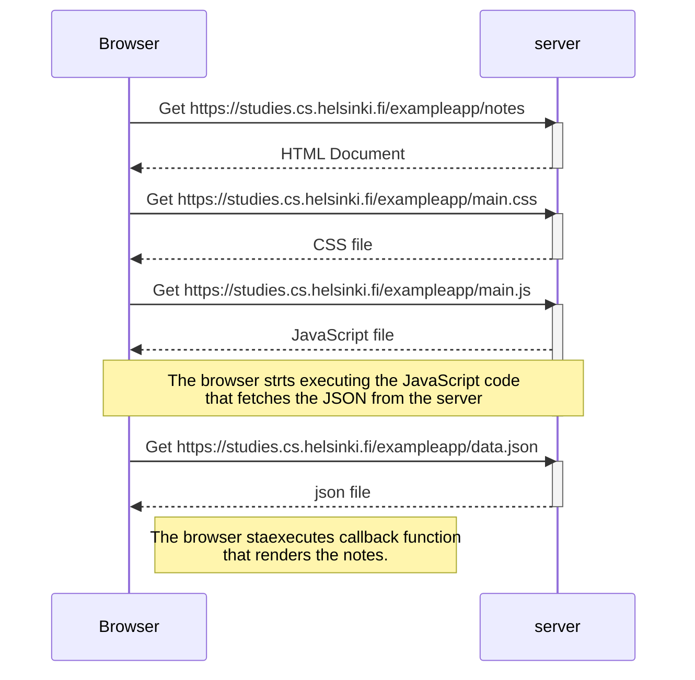

```mermaid
sequenceDiagram
    participant Browser
    participant server
  
    Browser->> server: Get https://studies.cs.helsinki.fi/exampleapp/notes
    activate server
    server-->> Browser: HTML Document
    deactivate server
    Browser->> server: Get https://studies.cs.helsinki.fi/exampleapp/main.css
    activate server
    server-->> Browser: CSS file
    deactivate server
    Browser->> server: Get https://studies.cs.helsinki.fi/exampleapp/main.js
    activate server
    server-->> Browser: JavaScript file
    Note over Browser, server: The browser strts executing the JavaScript code <br> that fetches the JSON from the server
    deactivate server
    Browser->> server: Get https://studies.cs.helsinki.fi/exampleapp/data.json
    activate server
    server-->> Browser: json file
    deactivate server
    Note right of Browser: The browser staexecutes callback function<br> that renders the notes.
    
    
```

