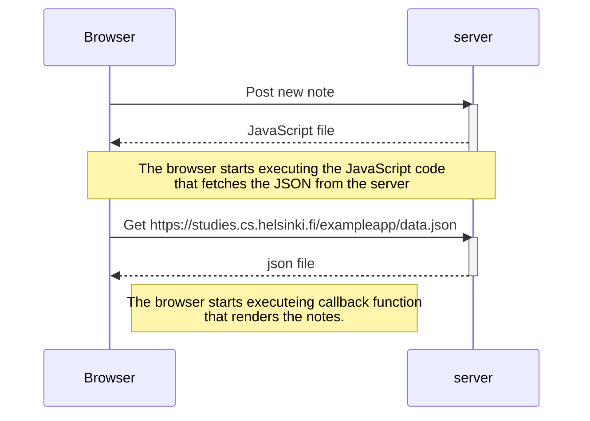

```mermaid
sequenceDiagram
    participant Browser
    participant server
  
    Browser->> server: Post new note
    activate server
    server-->> Browser: JavaScript file
    Note over Browser, server: The browser starts executing the JavaScript code <br> that fetches the JSON from the server
    deactivate server
    Browser->> server: Get https://studies.cs.helsinki.fi/exampleapp/data.json
    activate server
    server-->> Browser: json file
    deactivate server
    Note right of Browser: The browser starts executeing callback function<br> that renders the notes.
    
    
```